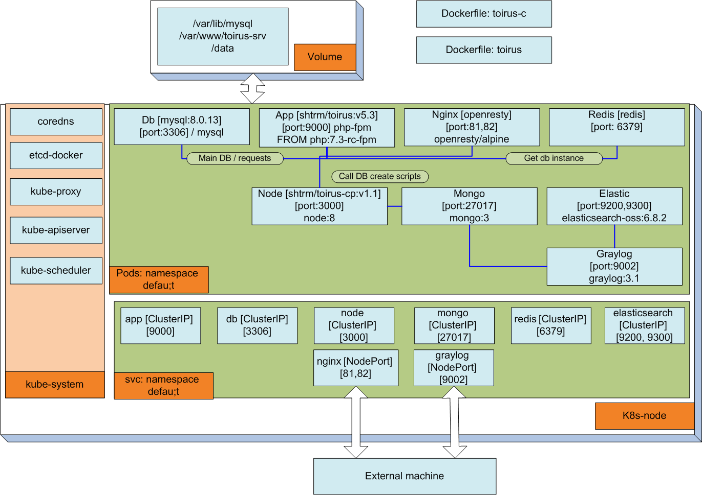

Конфигурация образов Тоирус для развертывания в кластере k8n

Описание:

конфигурационные файлы системы Тоирус делятся на базовый дистрибутив и сервисное ПО

Базовый дистрибутив состоит из:

app-deployment - контейнера приложения Тоирус на базе Yii2 фреймворка

app-service - сервиса приложения (php-fpm) 9002 порт

db-deployment -  контейнера базы данных на базе mysql image

db-service - сервиса MySQL 3306 порт

redis-deployment - контейнера redis на базе базового образа

redis-service - сервиса Redis для подключения приложения (хранит свзяки логинов/пользователей/карточек и экземпляров приложения для SaaS) порт 6379

nginx-deployment - контейнера nginx - веб-сервера приложения 

nginx-service - сервис с настройками внешнего доступа извне кластера 81 порт в кластере

nodeport-service - вариант настройки сервиса с nodeport внешним доступом (проброс на порт из диапазона >30000) 

node-deployment - контейнер node на базе образа node и урезанной версии контрольной панели для запуска скриптов разворачивания системы и сервисных функций

node-service - сервис Node для подключения приложения (запуск скрипта через сервис nodejs, который в свою очередь делает вызовы на адрес API сервера основного приложения) порт 3000

ingress-* - варианты настройки доступа к кластеру через ingress service 

conf/* - конфигурационные файлы элементов системы

docker-config/* - базовые конфигурационные файлы kubernetes кластера полученные в результате работы kompose (из коробки естественно не работают)

docker-compose - конфигурация связки graylog+mongo+elasticsearch для docker 

graylog/elastic-deployment - контейнер сервиса elasticsearch (нужен для graylog)

graylog/elastic-service - сервис elasticsearch (порты 9200/9300)

graylog/mongo-deployment - контейнер базы данных mongo (нужен для graylog)

graylog/mongo-service - сервис базы данных mongo (порты 27017)

graylog/gray-deployment - контейнер сервиса Graylog (нужен для graylog)

graylog/gray-service - сервис Graylog (порты 9000)

Руководство к действию:

для docker (снаружи директории docker с дистрибутивом)

1) init.sh - делает всю магию

2) create_db.sh - разворачивает в кластере  базу
 
3) start/restart и прочие скрипты перезапускают часть подов/сервисов и volumes
